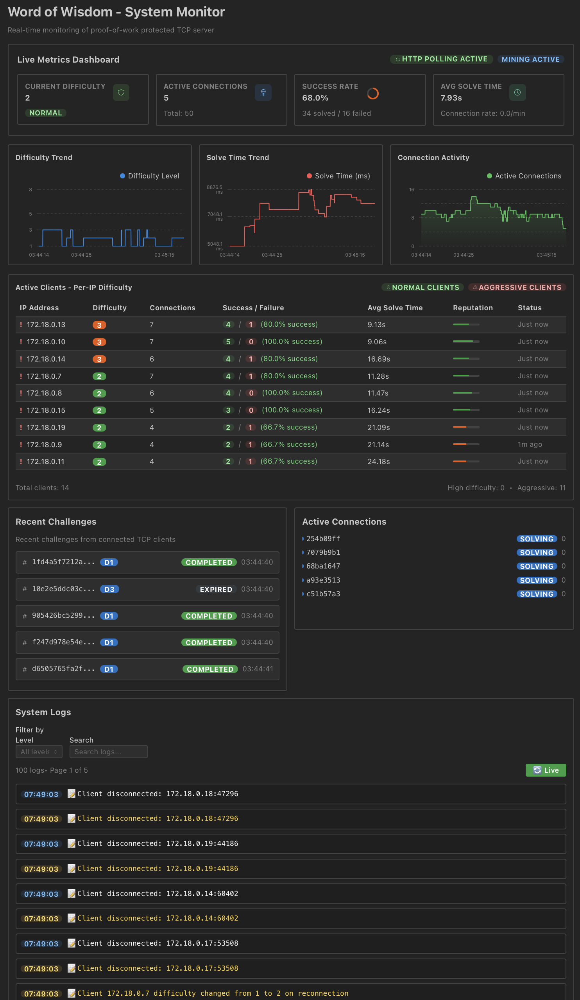

# Word of Wisdom - TCP Server with PoW Protection


A simple TCP server that serves wisdom quotes protected by Proof-of-Work (PoW) challenges. Features Argon2 memory-hard puzzles, adaptive difficulty, real-time visualization, and PostgreSQL persistence.

## 🚀 Quick Start

```bash
# Setup environment (first time only)
cp .env.example .env

# Start complete system with docker-compose
docker-compose up -d

# Access services
# - Web UI: http://localhost:3000  
# - TCP Server: localhost:8080
# - WebSocket + REST API: http://localhost:8081
```

## ✨ Features

- **🛡️ Advanced Security**: Argon2 memory-hard PoW puzzles with adaptive difficulty
- **💾 Data Persistence**: PostgreSQL for metrics and application data
- **📊 Real-time Monitoring**: Interactive React dashboard with live WebSocket updates
- **🚀 REST API**: Type-safe database operations with sqlc-generated queries
- **🔄 Auto-Recovery**: Robust error handling with automatic reconnection
- **🐳 Docker Ready**: Simple docker-compose setup for local development

## ⚙️ Environment Configuration

The application uses environment variables for configuration management. To get started:

1. **Copy the example environment file:**
   ```bash
   cp .env.example .env
   ```

2. **Edit the .env file** to customize your setup if needed

3. **Start the services:**
   ```bash
   docker-compose up -d
   ```

The `.env` file contains all configurable variables with sensible defaults:

| Variable | Default | Description |
|----------|---------|-------------|
| `SERVER_PORT` | 8080 | TCP server port |
| `WEBSERVER_PORT` | 8081 | REST API server port |
| `WEB_PORT` | 3000 | Frontend port |
| `API_BASE_URL` | http://localhost:8081/api/v1 | API endpoint URL |
| `POSTGRES_*` | Various | Database configuration |
| `ALGORITHM` | argon2 | PoW algorithm (sha256/argon2) |
| `DIFFICULTY` | 2 | Mining difficulty |

**Note:** Environment variables are automatically loaded by docker-compose from the `.env` file.

## 📊 Proof-of-Work Algorithm Comparison


### SHA-256 vs Argon2 Performance Analysis

| Aspect | SHA-256 PoW | Argon2 PoW |
|--------|-------------|------------|
| **Solve Time** | ~0.33s (20 bits) | ~0.07s (t=3, m=64MB, p=4) |
| **Memory Usage** | Negligible | 64MB (adjustable) |
| **GPU/ASIC Advantage** | >100× speedup | ≤32× (memory limits parallelism) |
| **Verification Cost** | <1ms (single hash) | ~70ms (memory-hard hash) |
| **Difficulty Tuning** | Leading-zero bits (coarse) | (time, memory, parallelism) parameters |
| **Implementation** | Very simple | Moderate (existing libraries) |

### Why Argon2 for DDoS Protection?

**SHA-256 Limitations:**

- CPU-bound only with negligible memory footprint
- Highly parallelizable on GPUs/ASICs (>100× speedup)
- Attackers can achieve millions of hashes per second
- Trivial solve times under specialized hardware attack

**Argon2 Advantages:**

- **Memory Hardness**: Forces 64MB+ per parallel thread
- **GPU Resistance**: Limited by available RAM (≤32× vs >100× for SHA-256)
- **Tunable Parameters**: Fine control via (time, memory, parallelism)
- **Future-Proof**: Maintains security as hardware improves

### Performance Benchmarks

**SHA-256 Performance:**

- ~1.56 million hashes/second per CPU core
- 20-bit difficulty: ~0.33s average solve time
- 24-bit difficulty: ~10s average solve time

**Argon2 Performance:**

- ~14 hashes/second with t=3, m=64MB, p=4
- Memory bandwidth becomes bottleneck
- Parallel scaling limited by RAM availability

**Conclusion:** While SHA-256 offers simplicity and minimal server cost, Argon2 provides superior resistance to large-scale, GPU-accelerated attacks through memory hardness, making it the preferred choice for robust DDoS mitigation.

## 🏗️ Architecture


### System Overview

The Word of Wisdom system is a simple, clean architecture with three core components running in Docker containers.

```shell
┌──────────────────────────────────────────────────────────────────────────────────┐
│                              Word of Wisdom System                               │
├─────────────┬─────────────┬─────────────┬──────────────────────────────────────────┤
│   Database  │ TCP Server  │ API Server  │            React Frontend               │
│   Layer     │ (Port 8080) │ (Port 8081) │            (Port 3000)                  │
├─────────────┼─────────────┼─────────────┼──────────────────────────────────────────┤
│             │             │             │                                          │
│ PostgreSQL  │ ┌─────────┐ │ ┌─────────┐ │ ┌──────────────────────────────────────┐ │
│             │ │ Argon2  │ │ │WebSocket│ │ │       Interactive Dashboard           │ │
│             │ │   PoW   │ │ │   API   │ │ │     + Real-time Metrics              │ │
│             │ │ Engine  │ │ │ Mining  │ │ │     + Blockchain Visualizer          │ │
│ ┌─────────┐ │ │Adaptive │ │ │  Sim    │ │ │     + Connection Status              │ │
│ │Metrics  │ │ │ Diff.   │ │ │ Control │ │ │     + Activity Logs                  │ │
│ │+ Logs   │ │ │ DDoS    │ │ │Real-time│ │ │     + DDoS Protection Status         │ │
│ │+ Blocks │ │ │Protect. │ │ │Updates  │ │ │     + Mining Controls                │ │
│ └─────────┘ │ └─────────┘ │ └─────────┘ │ └──────────────────────────────────────┘ │
└─────────────┴─────────────┴─────────────┴──────────────────────────────────────────┘
```

### Core Components

#### 1. **Database Layer** (PostgreSQL)

**PostgreSQL Database:**

- **Primary Storage**: All application data with ACID compliance
- **Type Safety**: Integration with sqlc for compile-time SQL validation

**Key Tables:**

```sql
-- Challenges (PoW puzzle tracking)
challenges(id, seed, difficulty, algorithm, client_id, status, created_at, solved_at)

-- Solutions (completed puzzles)  
solutions(id, challenge_id, nonce, hash, attempts, solve_time_ms, verified)

-- Connections (client session tracking)
connections(id, client_id, remote_addr, status, algorithm, connected_at)

-- Blocks (blockchain-like storage)
blocks(id, block_index, challenge_id, solution_id, quote, previous_hash, block_hash)

-- Metrics (system metrics)
metrics(time, metric_name, metric_value, labels, server_instance)

-- Logs (activity logs)  
logs(id, timestamp, level, message, icon, metadata, created_at)
```

#### 2. **TCP Server** (Port 8080) - Core PoW Engine

**Responsibilities:**

- Handle raw TCP connections from clients
- Generate and validate Proof-of-Work challenges
- Serve wisdom quotes to successful solvers
- Adaptive difficulty adjustment based on network load

**PoW Algorithm Implementation:**

```go
// Argon2 (Default - Memory-Hard)
type Argon2Challenge struct {
    Seed      string `json:"seed"`
    Difficulty int   `json:"difficulty"` 
    Time      uint32 `json:"time"`      // t=3
    Memory    uint32 `json:"memory"`    // m=64MB  
    Threads   uint8  `json:"threads"`   // p=4
    KeyLength uint32 `json:"keyLength"` // 32 bytes
}
```

**Adaptive Security Features:**

- **Dynamic Difficulty**: Adjusts 1-6 based on solve times and connection rate
- **Resource Protection**: CPU and memory usage monitoring
- **Connection Limits**: Per-IP rate limiting and concurrent connection caps

#### 3. **API Server** (Port 8081) - REST API

**REST API:**

- **Read-Only Database Access**: Serves data to frontend via HTTP endpoints
- **OpenAPI Specification**: Documented API with typed responses
- **Real-Time Polling**: Frontend polls for live data updates
- **Echo Framework**: High-performance HTTP server with middleware

**Key Message Types:**

```typescript
// Client → Server
{ type: "start_mining", config: MiningConfig }
{ type: "stop_mining" }
{ type: "get_state" }

// Server → Client  
{ type: "block", block: Block }
{ type: "challenge", challenge: Challenge }
{ type: "metrics", metrics: MetricsData }
{ type: "stats", stats: MiningStats }
{ type: "log", log: LogMessage }
```

**Database Integration:**

- **SQLC Generated Queries**: Type-safe database operations
- **Automatic Logging**: All events stored to database
- **Metrics Recording**: Difficulty adjustments, connection stats, performance data

#### 4. **React Frontend** (Port 3000) - Interactive Dashboard

**Component Architecture:**

```typescript
App.tsx                          // Main application container
├── ConnectionStatus.tsx         // WebSocket connection indicator
├── BlockchainVisualizer.tsx     // Visual blockchain representation
├── MiningVisualizer.tsx         // Real-time challenge tracking
├── MetricsDashboard.tsx         // Live metrics and charts
├── StatsPanel.tsx               // Performance statistics
├── LogsPanel.tsx                // Activity logs with search
├── ConnectionsPanel.tsx         // Active client connections
└── MiningConfigPanel.tsx        // Mining simulation controls
```

**Real-Time Features:**

- **WebSocket Integration**: Live updates with automatic reconnection
- **Persistent State**: All data from database
- **Interactive Controls**: Start/stop mining, configure parameters
- **Responsive Design**: Mantine UI components with dark theme

**Key Visualizations:**

```typescript
// Live Metrics Dashboard
interface MetricsData {
  timestamp: number
  connectionsTotal: number
  currentDifficulty: number
  puzzlesSolvedTotal: number
  puzzlesFailedTotal: number
  averageSolveTime: number
  connectionRate: number
  difficultyAdjustments: number
  activeConnections: number
}
```

## 🔧 Configuration

### Environment Variables

```bash
# Database
POSTGRES_HOST=localhost
POSTGRES_PORT=5432
POSTGRES_USER=wisdom
POSTGRES_PASSWORD=wisdom123

# Algorithm Selection
ALGORITHM=argon2  # or sha256
DIFFICULTY=2
ADAPTIVE_MODE=true
```

## 📈 Web Dashboard Features

- **📊 Live Metrics**: Real-time difficulty and performance tracking
- **🔗 Blockchain View**: Visual representation of solved challenges
- **📋 Activity Logs**: Real-time system activity logs
- **🔄 Connection Status**: WebSocket state with auto-reconnection
- **💾 Persistent Stats**: Data survives page refresh

## 🧪 Testing

### Automated Testing

```bash
# Unit tests
go test ./...

# Integration tests  
go test -v ./tests/

# Start system for testing
docker-compose up -d

# Test API endpoints
curl -s "http://localhost:8081/health"
curl -s "http://localhost:8081/api/challenges" | jq '.'
```

## 🐳 Docker Deployment

### Docker Compose Setup

```bash
# Start all services
docker-compose up -d

# Check service health
docker-compose ps

# View logs
docker-compose logs -f

# Stop services
docker-compose down
```

## 📁 Project Structure


```shell
world-of-wisdom/
├── cmd/                          # Executable entry points
│   ├── server/                   # TCP server (Argon2 PoW)
│   ├── client/                   # Test client
│   └── apiserver/                # REST API server
├── internal/                     # Application logic
│   ├── server/                   # TCP server implementation
│   ├── apiserver/                # API server implementation
│   └── client/                   # Client implementation
├── api/db/                       # Generated database code (sqlc)
│   ├── *.sql.go                  # Type-safe database queries
│   ├── models.go                 # Database models
│   └── querier.go                # Query interface
├── pkg/                          # Shared libraries
│   ├── pow/                      # PoW algorithms (Argon2)
│   ├── database/                 # PostgreSQL integration
│   ├── config/                   # Environment configuration
│   └── wisdom/                   # Quote management
├── web/                          # React frontend
│   ├── src/
│   │   ├── components/           # UI components
│   │   │   ├── BlockchainVisualizer.tsx
│   │   │   ├── MetricsDashboard.tsx
│   │   │   ├── MiningConfigPanel.tsx
│   │   │   ├── ConnectionStatus.tsx
│   │   │   └── LogsPanel.tsx
│   │   ├── hooks/                # Custom React hooks
│   │   │   └── useWebSocket.ts   # WebSocket with reconnection
│   │   ├── types/                # TypeScript definitions
│   │   │   └── index.ts
│   │   └── utils/                # Utility functions
│   │       └── api.ts            # API client
│   ├── package.json              # Frontend dependencies
│   └── vite.config.ts            # Build configuration
├── db/                           # Database layer
│   ├── migrations/               # Database schema
│   │   ├── 001_init.sql          # Initial schema
│   │   └── 002_logs.sql          # Logs table
│   └── queries/                  # SQL queries for sqlc
│       ├── challenges.sql        # Challenge management
│       ├── solutions.sql         # Solution tracking
│       ├── connections.sql       # Client connections
│       ├── blocks.sql            # Blockchain data
│       ├── metrics.sql           # System metrics
│       └── logs.sql              # Activity logs
├── docs/                         # API documentation
│   ├── swagger.json              # OpenAPI 3.0 specification
│   └── swagger.yaml              # YAML format
├── scripts/                      # Utility scripts
│   ├── clear-database.sql        # Database cleanup
│   ├── dev.sh                    # Development setup
│   └── load-test.sh              # Load testing
├── tests/                        # Integration tests
│   └── integration_test.go       # End-to-end testing
├── images/                       # Documentation assets
│   ├── arch.jpeg                 # Architecture diagram
│   └── front-demo.png            # Frontend screenshot
├── docker-compose.yml            # Main orchestration
├── sqlc.yaml                     # SQLC configuration
├── go.mod / go.sum               # Go module dependencies
├── Makefile                      # Build automation
└── CLAUDE.md                     # Project instructions
```

### Key Directories Explained

**Core Services:**

- `cmd/` - Each subdirectory contains a `main.go` for a specific service
- `internal/` - Private application code, not importable by other projects
- `api/db/` - Auto-generated type-safe database code via sqlc

**Frontend & API:**

- `web/src/components/` - React components with real-time updates
- `docs/` - Auto-generated OpenAPI documentation
- `db/queries/` - SQL source files for sqlc code generation

**Infrastructure:**

- `docker-compose.yml` - Complete stack deployment
- `scripts/` - Development and testing automation

**Database Architecture:**

- PostgreSQL for all data storage
- Type-safe queries with sqlc
- Clean migrations and schema

## 🔄 Recent Improvements

- ✅ **Enhanced Security**: SHA-256 → Argon2 memory-hard PoW
- ✅ **Database Integration**: PostgreSQL with SQLC type-safe queries
- ✅ **Frontend Stability**: Persistent stats, enhanced logs, auto-recovery
- ✅ **Live Metrics**: Real-time difficulty tracking and updates
- ✅ **WebSocket Resilience**: Auto-reconnection and graceful degradation
- ✅ **REST API**: Type-safe database operations with comprehensive endpoints
- ✅ **OpenAPI Documentation**: Interactive Swagger UI with complete API specs
- ✅ **Docker Ready**: Simple docker-compose setup for local development

### 🖼️ Frontend Demo



## 📜 License

Educational project demonstrating advanced Go programming, cryptographic PoW systems, real-time web applications, and clean architecture.

---

**Built with:** Go, React, TypeScript, PostgreSQL, Docker, Mantine UI
