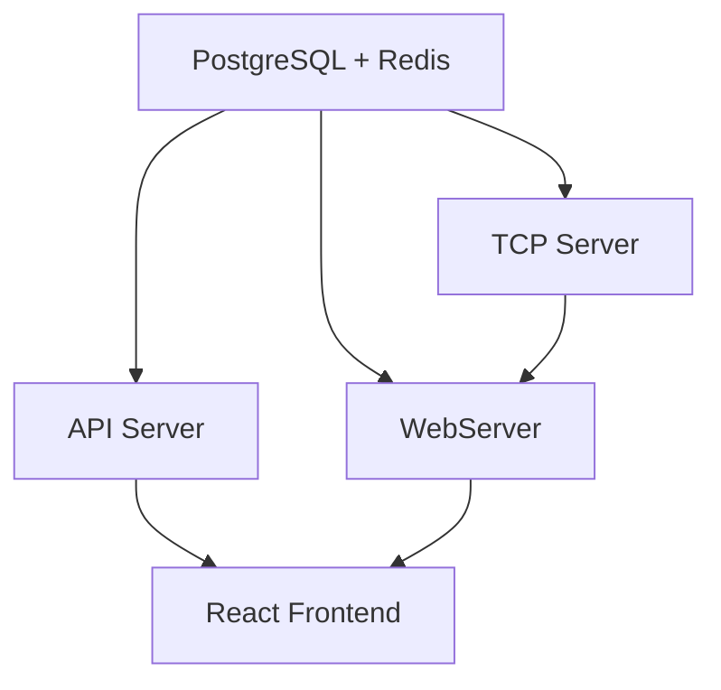

# Word of Wisdom - TCP Server with PoW Protection


A production-ready TCP server that serves wisdom quotes protected by Proof-of-Work (PoW) challenges. Features Argon2 memory-hard puzzles, adaptive difficulty, real-time visualization, PostgreSQL/TimescaleDB persistence, and comprehensive monitoring.

## 🚀 Quick Start

```bash
# Start complete system with databases
make re-run

# Access services
# - Web UI: http://localhost:3000  
# - TCP Server: localhost:8080
# - REST API: http://localhost:8082/api/v1
# - API Docs: http://localhost:8082/api/v1/docs
# - Metrics: http://localhost:2112/metrics
```

## ✨ Features

- **🛡️ Advanced Security**: Argon2 memory-hard PoW puzzles with adaptive difficulty
- **💾 Data Persistence**: PostgreSQL/TimescaleDB for metrics, Redis for caching  
- **📊 Real-time Monitoring**: Interactive React dashboard with live WebSocket updates
- **🚀 REST API Gateway**: Type-safe database operations with sqlc-generated queries
- **🔍 Service Discovery**: Microservices architecture with service registry
- **⚖️ Load Balancing**: Gateway with intelligent request routing
- **🔄 Auto-Recovery**: Robust error handling with automatic reconnection
- **📈 Comprehensive Metrics**: Prometheus integration with 10+ metrics
- **🐳 Production Ready**: Docker deployment with health checks and restart policies

## 📊 Proof-of-Work Algorithm Comparison


### SHA-256 vs Argon2 Performance Analysis

| Aspect | SHA-256 PoW | Argon2 PoW |
|--------|-------------|------------|
| **Solve Time** | ~0.33s (20 bits) | ~0.07s (t=3, m=64MB, p=4) |
| **Memory Usage** | Negligible | 64MB (adjustable) |
| **GPU/ASIC Advantage** | >100× speedup | ≤32× (memory limits parallelism) |
| **Verification Cost** | <1ms (single hash) | ~70ms (memory-hard hash) |
| **Difficulty Tuning** | Leading-zero bits (coarse) | (time, memory, parallelism) parameters |
| **Implementation** | Very simple | Moderate (existing libraries) |

### Why Argon2 for DDoS Protection?

**SHA-256 Limitations:**

- CPU-bound only with negligible memory footprint
- Highly parallelizable on GPUs/ASICs (>100× speedup)
- Attackers can achieve millions of hashes per second
- Trivial solve times under specialized hardware attack

**Argon2 Advantages:**

- **Memory Hardness**: Forces 64MB+ per parallel thread
- **GPU Resistance**: Limited by available RAM (≤32× vs >100× for SHA-256)
- **Tunable Parameters**: Fine control via (time, memory, parallelism)
- **Future-Proof**: Maintains security as hardware improves

### Performance Benchmarks

**SHA-256 Performance:**

- ~1.56 million hashes/second per CPU core
- 20-bit difficulty: ~0.33s average solve time
- 24-bit difficulty: ~10s average solve time

**Argon2 Performance:**

- ~14 hashes/second with t=3, m=64MB, p=4
- Memory bandwidth becomes bottleneck
- Parallel scaling limited by RAM availability

**Conclusion:** While SHA-256 offers simplicity and minimal server cost, Argon2 provides superior resistance to large-scale, GPU-accelerated attacks through memory hardness, making it the preferred choice for robust DDoS mitigation.

## 🏗️ Architecture


### System Overview

The Word of Wisdom system is a production-ready, microservices-based proof-of-work protection system with real-time monitoring and adaptive security. The architecture consists of five core components orchestrated through Docker Compose with comprehensive health checks and monitoring.

```shell
┌──────────────────────────────────────────────────────────────────────────────────┐
│                              Word of Wisdom System                               │
├─────────────┬─────────────┬─────────────┬─────────────┬──────────────────────────┤
│   Database  │ TCP Server  │ Web Server  │ API Server  │    React Frontend        │
│   Layer     │ (Port 8080) │ (Port 8081) │ (Port 8082) │    (Port 3000)           │
├─────────────┼─────────────┼─────────────┼─────────────┼──────────────────────────┤
│             │             │             │             │                          │
│ PostgreSQL  │ ┌─────────┐ │ ┌─────────┐ │ ┌─────────┐ │ ┌──────────────────────┐ │
│ TimescaleDB │ │ Argon2  │ │ │WebSocket│ │ │ REST    │ │ │ Blockchain Visualizer│ │
│   + Redis   │ │   PoW   │ │ │   API   │ │ │   API   │ │ │   + Live Metrics     │ │
│             │ │ Engine  │ │ │ Mining  │ │ │  sqlc   │ │ │ Interactive Controls │ │
│ ┌─────────┐ │ │Adaptive │ │ │  Sim    │ │ │ Queries │ │ │   Connection Status  │ │
│ │Time-    │ │ │ Diff.   │ │ │ Control │ │ │  CRUD   │ │ │  DDoS Protection     │ │
│ │Series   │ │ │ DDoS    │ │ │Real-time│ │ │OpenAPI  │ │ │     Dashboard        │ │
│ │Metrics  │ │ │Protect. │ │ │Updates  │ │ │  Docs   │ │ │   Network Activity   │ │
│ │+ Logs   │ │ │Prometh. │ │ │Load Mgmt│ │ │Type-Safe│ │ │       Logs           │ │
│ └─────────┘ │ └─────────┘ │ └─────────┘ │ └─────────┘ │ └──────────────────────┘ │
└─────────────┴─────────────┴─────────────┴─────────────┴──────────────────────────┘
```

### Core Components

#### 1. **Database Layer** (PostgreSQL + TimescaleDB + Redis)

**PostgreSQL with TimescaleDB Extension:**

- **Primary Storage**: All application data with ACID compliance
- **Time-Series Optimization**: Automatic partitioning for metrics and logs
- **Hypertables**: `metrics` and `logs` tables optimized for time-series workloads
- **Retention Policies**: Automatic cleanup (30 days for metrics, 7 days for logs)
- **Type Safety**: Integration with sqlc for compile-time SQL validation

**Key Tables:**

```sql
-- Challenges (PoW puzzle tracking)
challenges(id, seed, difficulty, algorithm, client_id, status, created_at, solved_at)

-- Solutions (completed puzzles)  
solutions(id, challenge_id, nonce, hash, attempts, solve_time_ms, verified)

-- Connections (client session tracking)
connections(id, client_id, remote_addr, status, algorithm, connected_at)

-- Blocks (blockchain-like storage)
blocks(id, block_index, challenge_id, solution_id, quote, previous_hash, block_hash)

-- Metrics (TimescaleDB hypertable)
metrics(time, metric_name, metric_value, labels, server_instance)

-- Logs (TimescaleDB hypertable)  
logs(id, timestamp, level, message, icon, metadata, created_at)
```

**Redis Cache:**

- **Session Management**: Fast lookup for active connections
- **Rate Limiting**: IP-based request throttling
- **Temporary Storage**: Challenge-response state

#### 2. **TCP Server** (Port 8080) - Core PoW Engine

**Responsibilities:**

- Handle raw TCP connections from clients
- Generate and validate Proof-of-Work challenges
- Serve wisdom quotes to successful solvers
- Adaptive difficulty adjustment based on network load

**PoW Algorithm Implementation:**

```go
// Argon2 (Default - Memory-Hard)
type Argon2Challenge struct {
    Seed      string `json:"seed"`
    Difficulty int   `json:"difficulty"` 
    Time      uint32 `json:"time"`      // t=3
    Memory    uint32 `json:"memory"`    // m=64MB  
    Threads   uint8  `json:"threads"`   // p=4
    KeyLength uint32 `json:"keyLength"` // 32 bytes
}

// SHA-256 (Alternative - CPU-Bound)
type SHA256Challenge struct {
    Seed       string `json:"seed"`
    Difficulty int    `json:"difficulty"` // Leading zero bits
}
```

**Adaptive Security Features:**

- **Dynamic Difficulty**: Adjusts 1-6 based on solve times and connection rate
- **Resource Protection**: CPU and memory usage monitoring
- **Connection Limits**: Per-IP rate limiting and concurrent connection caps
- **Algorithm Selection**: Runtime switching between SHA-256 and Argon2

**Metrics Integration:**

- Records all puzzle attempts, solve times, and difficulty adjustments
- Exports Prometheus metrics on port 2112
- Tracks performance statistics for dashboard visualization

#### 3. **Web Server** (Port 8081) - Real-Time API Gateway

**WebSocket API:**

- **Bidirectional Communication**: Real-time updates to frontend
- **Mining Simulation Control**: Start/stop/configure mining sessions
- **Live Data Streams**: Blocks, challenges, connections, metrics
- **Load Management**: Message batching and throttling during high load
- **Graceful Degradation**: Falls back to polling API when WebSocket fails

**Key Message Types:**

```typescript
// Client → Server
{ type: "start_mining", config: MiningConfig }
{ type: "stop_mining" }
{ type: "get_state" }

// Server → Client  
{ type: "block", block: Block }
{ type: "challenge", challenge: Challenge }
{ type: "metrics", metrics: MetricsData }
{ type: "stats", stats: MiningStats }
{ type: "log", log: LogMessage }
{ type: "init", blocks: Block[], challenges: Challenge[] }
```

**Mining Simulation Engine:**

```go
type MiningConfig struct {
    InitialIntensity  int  `json:"initialIntensity"`  // 1-4 scale
    MaxIntensity      int  `json:"maxIntensity"`      
    IntensityStep     int  `json:"intensityStep"`     // seconds between changes
    AutoScale         bool `json:"autoScale"`         // enable auto-scaling
    MinMiners         int  `json:"minMiners"`         // concurrent miners
    MaxMiners         int  `json:"maxMiners"`         
    Duration          int  `json:"duration"`          // simulation duration
    HighPerformance   bool `json:"highPerformance"`   // boost difficulty
    CPUIntensive      bool `json:"cpuIntensive"`      // stress testing
    RealisticMode     bool `json:"realisticMode"`     // production-like behavior
}
```

**Database Integration:**

- **SQLC Generated Queries**: Type-safe database operations
- **Automatic Logging**: All events stored to hypertable logs
- **Metrics Recording**: Difficulty adjustments, connection stats, performance data
- **State Persistence**: Mining sessions survive server restarts

#### 4. **API Server** (Port 8082) - RESTful Data Gateway

**OpenAPI Documentation:** Full Swagger/OpenAPI 3.0 specification at `/api/v1/docs`

**Core Endpoints:**

```yaml
# Challenges Management
GET    /api/v1/challenges              # List recent challenges
GET    /api/v1/challenges/{id}         # Get specific challenge
POST   /api/v1/challenges              # Create new challenge
PUT    /api/v1/challenges/{id}         # Update challenge status

# Solutions & Results  
GET    /api/v1/solutions               # List verified solutions
POST   /api/v1/solutions               # Submit solution for verification

# Connections & Sessions
GET    /api/v1/connections             # Active connections
GET    /api/v1/connections/{id}        # Connection details
DELETE /api/v1/connections/{id}        # Disconnect client

# Blockchain Data
GET    /api/v1/blocks                  # Blockchain history
GET    /api/v1/blocks/{id}             # Specific block

# Metrics & Analytics
GET    /api/v1/metrics                 # Current system metrics
GET    /api/v1/metrics/history         # Historical data
GET    /api/v1/stats                   # Performance statistics

# Activity Logs
GET    /api/v1/logs                    # Recent activity logs
GET    /api/v1/logs/search             # Search logs by criteria

# System Operations
POST   /api/v1/clear                   # Clear all data
GET    /api/v1/health                  # Health check
```

**SQLC Integration:**

All database operations use generated, type-safe queries:

```go
// Generated by sqlc from SQL files
type Queries struct { *sql.DB }

func (q *Queries) GetRecentChallenges(ctx context.Context, limit int32) ([]Challenge, error)
func (q *Queries) CreateChallenge(ctx context.Context, arg CreateChallengeParams) (Challenge, error)
func (q *Queries) CountDifficultyAdjustments(ctx context.Context) (int64, error)
func (q *Queries) RecordMetric(ctx context.Context, arg RecordMetricParams) error
```

**Response Format:**

```json
{
  "data": [...],           // Main response data
  "timestamp": "2025-01-13T15:30:45Z",
  "metadata": {
    "total": 150,          // Total records
    "page": 1,             // Current page
    "limit": 50            // Records per page
  }
}
```

#### 5. **React Frontend** (Port 3000) - Interactive Dashboard

**Component Architecture:**

```typescript
App.tsx                          // Main application container
├── ConnectionStatus.tsx         // WebSocket connection indicator
├── BlockchainVisualizer.tsx     // Visual blockchain representation
├── MiningVisualizer.tsx         // Real-time challenge tracking
├── MetricsDashboard.tsx         // Live metrics and charts
├── StatsPanel.tsx               // Performance statistics
├── LogsPanel.tsx                // Activity logs with search
├── ConnectionsPanel.tsx         // Active client connections
└── MiningConfigPanel.tsx        // Mining simulation controls
```

**Real-Time Features:**

- **WebSocket Integration**: Live updates with automatic reconnection
- **Graceful Degradation**: Falls back to API polling during high load
- **Persistent State**: No localStorage - all data from database
- **Interactive Controls**: Start/stop mining, configure parameters
- **Responsive Design**: Mantine UI components with dark theme

**Key Visualizations:**

```typescript
// Live Metrics Dashboard
interface MetricsData {
  timestamp: number
  connectionsTotal: number
  currentDifficulty: number
  puzzlesSolvedTotal: number
  puzzlesFailedTotal: number
  averageSolveTime: number
  connectionRate: number
  difficultyAdjustments: number  // ✅ Now tracks real adjustments
  activeConnections: number
}

// DDoS Protection Status
<Paper>
  <Title>DDoS Protection Status</Title>
  <Text>Adaptive difficulty adjustments: {metrics.difficultyAdjustments}</Text>
  <Badge color={connectionRate > 20 ? 'red' : 'green'}>
    {connectionRate > 20 ? 'High Load Detected' : 'Normal Operation'}
  </Badge>
</Paper>
```

### Data Flow Architecture

#### 1. **Client Connection Flow**

```shell
Client TCP → Server:8080 → PostgreSQL → WebServer:8081 → Frontend:3000
    ↓            ↓            ↓             ↓              ↓
1. Connect    2. Generate   3. Store     4. Broadcast   5. Display
              Challenge     Challenge    WebSocket      Real-time
```

#### 2. **PoW Verification Flow**

```shell
Client Solution → Server Validation → Database Update → Metrics → Dashboard
     ↓                 ↓                    ↓            ↓         ↓
1. Submit Hash   2. Verify Argon2    3. Record Result  4. Update  5. Show Stats
```

#### 3. **Difficulty Adjustment Flow**

```shell
Network Load → Server Analysis → Difficulty Change → Database Record → Dashboard Update
     ↓              ↓                  ↓                  ↓              ↓
1. Monitor     2. Calculate       3. Adjust Level    4. Store Event  5. Show Count
   Intensity      Thresholds        (1-6 scale)
```

#### 4. **Real-Time Updates Flow**

```shell
Database Event → WebServer → WebSocket → React State → UI Update
     ↓              ↓          ↓           ↓            ↓
1. Challenge    2. Process   3. Broadcast 4. State     5. Render
   Completed      Event        Message      Update       Component
```

### Security Architecture

#### **Multi-Layer DDoS Protection**

1. **Network Level**: Connection rate limiting, IP-based throttling
2. **Application Level**: Adaptive PoW difficulty (1-6 scale)
3. **Resource Level**: Memory and CPU usage monitoring
4. **Database Level**: Connection pooling, query optimization

#### **Proof-of-Work Security**

```go
// Argon2 Parameters (Memory-Hard)
const (
    DefaultTime    = 3        // Time cost
    DefaultMemory  = 64 * 1024 // 64MB memory
    DefaultThreads = 4        // Parallelism  
    DefaultKeyLen  = 32       // Output length
)

// Difficulty scaling (automatic)
if avgSolveTime < 1*time.Second && connectionRate > 20 {
    difficulty = min(6, difficulty + 1)  // Increase protection
} else if avgSolveTime > 5*time.Second && connectionRate < 5 {
    difficulty = max(1, difficulty - 1)  // Reduce overhead
}
```

### Monitoring & Observability

#### **Prometheus Metrics** (Port 2112)

```prometheus
# Connection metrics
wisdom_connections_total{status="accepted|rejected|timeout"}
wisdom_active_connections
wisdom_connection_rate_per_minute

# PoW metrics
wisdom_puzzles_solved_total{difficulty="1-6", algorithm="sha256|argon2"}
wisdom_puzzles_failed_total{difficulty="1-6"}
wisdom_current_difficulty
wisdom_difficulty_adjustments_total{direction="increase|decrease|boost"}

# Performance metrics  
wisdom_solve_time_seconds{difficulty="1-6"}
wisdom_average_solve_time_seconds
wisdom_hash_rate_hashes_per_second
```

#### **Health Checks**

All services include comprehensive health endpoints:

- **Database**: Connection pool status, query performance
- **TCP Server**: Active connections, resource usage
- **WebServer**: WebSocket connections, message queue status  
- **API Server**: Response times, error rates
- **Frontend**: Build status, asset loading

### Deployment Architecture

#### **Docker Compose Orchestration**

```yaml
services:
  postgres:     # TimescaleDB with automatic migrations
  redis:        # Caching and session management
  server:       # TCP PoW server with metrics
  webserver:    # WebSocket API with load management
  apiserver:    # REST API with OpenAPI docs
  web:          # React frontend with optimized builds
  
volumes:
  postgres_data:  # Persistent database storage
  redis_data:     # Cache persistence
  
networks:
  wisdom-net:     # Internal service communication
```

#### **Service Dependencies**



#### **Health Check Strategy**

- **Startup Probe**: Verify service initialization
- **Liveness Probe**: Detect and restart failed services  
- **Readiness Probe**: Control traffic routing
- **Dependency Checks**: Wait for database availability

This architecture provides a robust, scalable, and observable proof-of-work protection system with real-time monitoring and adaptive security capabilities.

## 🔧 Configuration

### Server Options

```bash
go run cmd/server/main.go [options]
```

| Flag | Default | Description |
|------|---------|-------------|
| `-algorithm` | `argon2` | PoW algorithm: `sha256` or `argon2` |
| `-port` | `:8080` | TCP port to listen on |
| `-difficulty` | `2` | Initial PoW difficulty (1-6) |
| `-timeout` | `30s` | Client connection timeout |
| `-adaptive` | `true` | Enable adaptive difficulty |
| `-metrics-port` | `:2112` | Prometheus metrics port |

### Environment Variables

```bash
# Database
POSTGRES_HOST=localhost
POSTGRES_PORT=5432
POSTGRES_USER=wisdom
POSTGRES_PASSWORD=wisdom123
REDIS_HOST=localhost
REDIS_PORT=6379

# Algorithm Selection
ALGORITHM=argon2  # or sha256
DIFFICULTY=2
ADAPTIVE_MODE=true
```

## 📈 Monitoring & Metrics

### Key Metrics (Prometheus)

```shell
# Connection metrics
wisdom_connections_total{status="accepted"}
wisdom_active_connections

# Challenge metrics  
wisdom_puzzles_solved_total{difficulty="N"}
wisdom_current_difficulty

# Performance metrics
wisdom_solve_time_seconds{difficulty="N"}
wisdom_average_solve_time_seconds
```

### Web Dashboard Features

- **📊 Live Metrics**: Real-time difficulty and performance tracking
- **🔗 Blockchain View**: Visual representation of solved challenges
- **📋 Enhanced Logs**: Paginated activity logs (latest first, 600px height)
- **🎮 Interactive Controls**: Demo mode with progress tracking
- **🔄 Connection Status**: WebSocket state with auto-reconnection
- **💾 Persistent Stats**: Data survives page refresh

## 🧪 Testing

### Automated Testing

```bash
# Unit tests
go test ./...

# Integration tests  
go test -v ./tests/

# Load testing with Docker scaling
docker-compose up --scale client1=10

# Database and API testing
curl -s "http://localhost:8082/api/v1/health"
curl -s "http://localhost:8082/api/v1/challenges" | jq '.'
```

### Interactive Web Interface Testing

**Available Test Modes:**

1. **📱 Demo Mode** (60 seconds)
   - Light load: 2-8 miners
   - Intensity scaling: 1→2
   - Perfect for demonstrations and basic functionality testing

2. **⚡ Stress Test** (2 minutes)
   - Moderate load: 5-15 miners  
   - Intensity scaling: 2→3
   - Tests adaptive difficulty and system resilience

3. **🏭 Realistic Mode** (5 minutes)
   - Production-like: 3-12 miners
   - Gradual scaling: 1→3 over 30s intervals
   - Long-duration simulation for stability testing

**Testing Steps:**

```bash
# 1. Open the dashboard
open http://localhost:3000

# 2. Test each mode progressively
# - Start with Demo Mode to verify basic functionality
# - Try Stress Test to check adaptive difficulty
# - Use Realistic Mode for extended stability testing

# 3. Monitor during tests
# - Watch real-time metrics and difficulty adjustments
# - Verify logs show mining activity with timestamps
# - Check WebSocket connection resilience during load

# 4. Verify data persistence
# - Refresh page during active mining
# - Check that stats and blockchain data persist
# - Confirm no localStorage is used (all data from database)
```

**Key Test Scenarios:**

- ✅ Difficulty adaptation under varying loads
- ✅ WebSocket reconnection and graceful degradation  
- ✅ Database persistence across browser refreshes
- ✅ Real-time metrics and live dashboard updates
- ✅ Mining simulation scaling and resource management

## 🐳 Production Deployment

### Docker Compose Setup

```bash
# Start all services with databases
docker-compose up -d

# Scale for load testing
docker-compose up --scale client1=5 --scale client2=3

# Check service health
docker-compose ps
```

### VPS Deployment (Planned)

```bash
# SSH to VPS instances
ssh vps_1_1  # Primary server
ssh vps_1_2  # Secondary server

# Deploy with GitHub Actions (planned)
# Or manual deployment:
make run-server
```

## 📁 Project Structure


```shell
world-of-wisdom/
├── cmd/                          # Executable entry points
│   ├── server/                   # TCP server (Argon2 PoW)
│   ├── client/                   # Test client
│   ├── webserver/                # WebSocket API
│   ├── apiserver/                # REST API server
│   ├── gateway/                  # API gateway & load balancer
│   ├── service-registry/         # Service discovery
│   ├── monitor/                  # System monitoring
│   └── load-client/              # Load testing client
├── internal/                     # Application logic
│   ├── server/                   # TCP server implementation
│   ├── webserver/                # WebSocket server implementation
│   ├── apiserver/                # REST API implementation
│   └── client/                   # Client implementation
├── api/db/                       # Generated database code (sqlc)
│   ├── *.sql.go                  # Type-safe database queries
│   ├── models.go                 # Database models
│   └── querier.go                # Query interface
├── pkg/                          # Shared libraries
│   ├── pow/                      # PoW algorithms (SHA-256 + Argon2)
│   ├── database/                 # PostgreSQL/Redis integration
│   ├── config/                   # Environment configuration
│   ├── metrics/                  # Prometheus metrics
│   ├── services/                 # Service discovery & registry
│   └── wisdom/                   # Quote management
├── web/                          # React frontend
│   ├── src/
│   │   ├── components/           # UI components
│   │   │   ├── BlockchainVisualizer.tsx
│   │   │   ├── MetricsDashboard.tsx
│   │   │   ├── MiningConfigPanel.tsx
│   │   │   ├── ConnectionStatus.tsx
│   │   │   └── LogsPanel.tsx
│   │   ├── hooks/                # Custom React hooks
│   │   │   └── useWebSocket.ts   # WebSocket with reconnection
│   │   ├── types/                # TypeScript definitions
│   │   │   └── index.ts
│   │   └── utils/                # Utility functions
│   │       ├── api.ts            # API client
│   │       └── persistence.ts    # Data persistence
│   ├── package.json              # Frontend dependencies
│   └── vite.config.ts            # Build configuration
├── db/                           # Database layer
│   ├── migrations/               # Database schema
│   │   ├── 001_init.sql          # Initial schema + TimescaleDB
│   │   └── 002_logs.sql          # Logs hypertable
│   └── queries/                  # SQL queries for sqlc
│       ├── challenges.sql        # Challenge management
│       ├── solutions.sql         # Solution tracking
│       ├── connections.sql       # Client connections
│       ├── blocks.sql            # Blockchain data
│       ├── metrics.sql           # Time-series metrics
│       └── logs.sql              # Activity logs
├── docs/                         # API documentation
│   ├── swagger.json              # OpenAPI 3.0 specification
│   └── swagger.yaml              # YAML format
├── scripts/                      # Utility scripts
│   ├── clear-database.sql        # Database cleanup
│   ├── deploy-vps.sh             # VPS deployment
│   ├── dev.sh                    # Development setup
│   └── load-test.sh              # Load testing
├── tests/                        # Integration tests
│   └── integration_test.go       # End-to-end testing
├── config/                       # Configuration files
│   ├── grafana-dashboard-config.yml
│   ├── grafana-datasource.yml
│   └── prometheus-test.yml
├── images/                       # Documentation assets
│   ├── arch.jpeg                 # Architecture diagram
│   ├── front-demo.png            # Frontend screenshot
│   └── *.jpeg                    # Additional diagrams
├── Dockerfile.*                  # Service-specific Dockerfiles
├── docker-compose.yml            # Main orchestration
├── docker-compose.*.yml          # Environment-specific configs
├── nginx.conf                    # Reverse proxy configuration
├── sqlc.yaml                     # SQLC configuration
├── go.mod / go.sum               # Go module dependencies
├── Makefile                      # Build automation
└── CLAUDE.md                     # Project instructions
```

### Key Directories Explained

**Core Services:**

- `cmd/` - Each subdirectory contains a `main.go` for a specific service
- `internal/` - Private application code, not importable by other projects
- `api/db/` - Auto-generated type-safe database code via sqlc

**Frontend & API:**

- `web/src/components/` - React components with real-time updates
- `docs/` - Auto-generated OpenAPI documentation
- `db/queries/` - SQL source files for sqlc code generation

**Infrastructure:**

- `docker-compose.yml` - Complete stack deployment
- `nginx.conf` - Load balancing and reverse proxy
- `scripts/` - Deployment and testing automation

**Database Architecture:**

- TimescaleDB hypertables for `metrics` and `logs`
- PostgreSQL for transactional data
- Redis for caching and session management
- Automatic retention policies (30d metrics, 7d logs)

## 🔄 Recent Improvements

- ✅ **Enhanced Security**: SHA-256 → Argon2 memory-hard PoW
- ✅ **Database Integration**: PostgreSQL + TimescaleDB + Redis with SQLC type-safe queries
- ✅ **Frontend Stability**: Persistent stats, enhanced logs, auto-recovery
- ✅ **Resource Safety**: Conservative limits prevent crashes under extreme load
- ✅ **Live Metrics**: Real-time difficulty tracking and updates
- ✅ **DDoS Protection Dashboard**: Fixed adaptive difficulty adjustments tracking - now shows actual count from database
- ✅ **WebSocket Resilience**: Message batching, throttling, and graceful degradation to API mode
- ✅ **REST API Gateway**: Type-safe database operations with comprehensive endpoints
- ✅ **OpenAPI Documentation**: Interactive Swagger UI with complete API specs
- ✅ **Microservices Architecture**: Service discovery, load balancing, and monitoring
- ✅ **Production Ready**: Restart policies, health checks, monitoring

### 🖼️ Frontend Demo


## 📜 License

Educational project demonstrating advanced Go programming, cryptographic PoW systems, real-time web applications, and production monitoring solutions.

---

**Built with:** Go, React, TypeScript, PostgreSQL, TimescaleDB, Redis, Docker, Prometheus, Mantine UI
